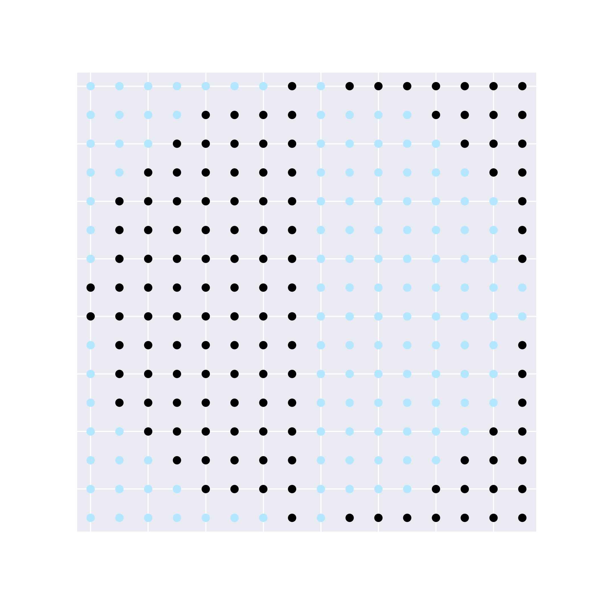
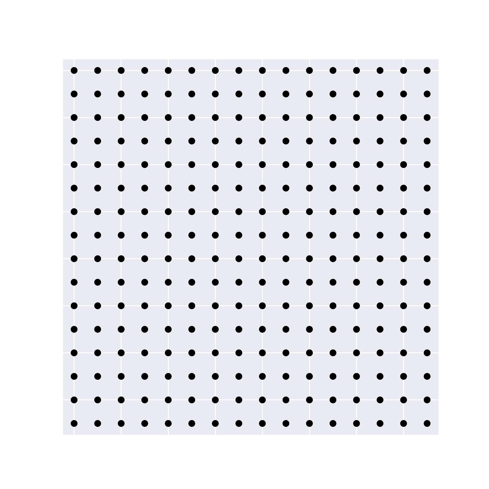
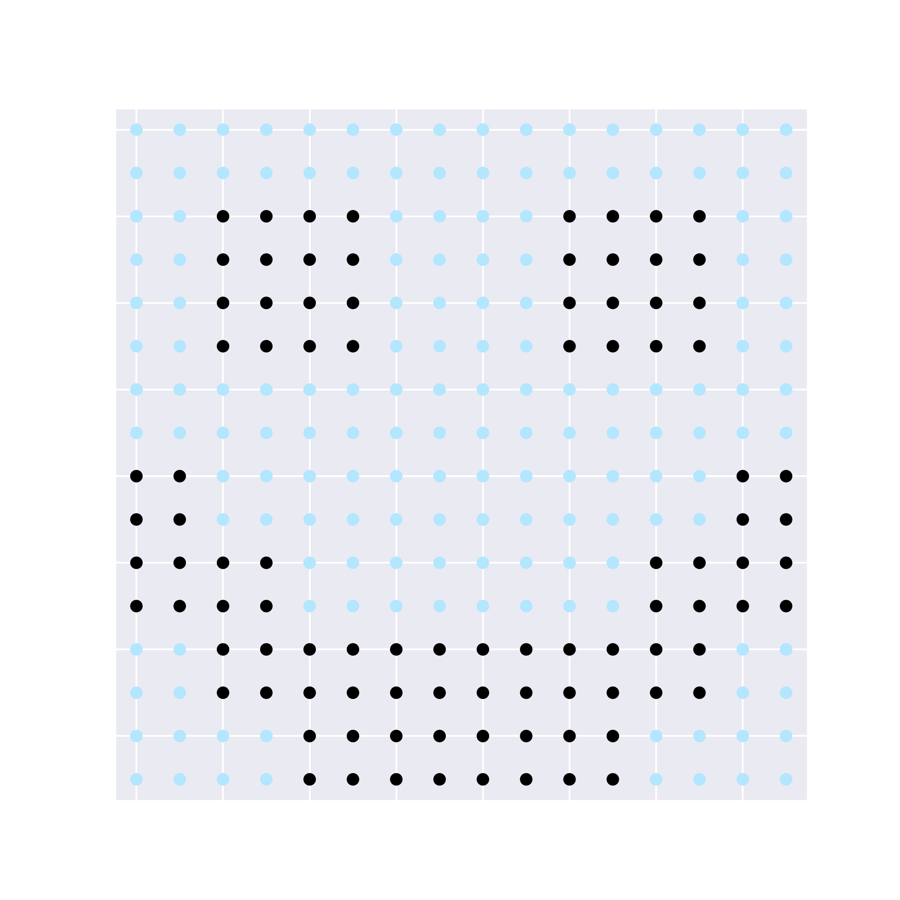
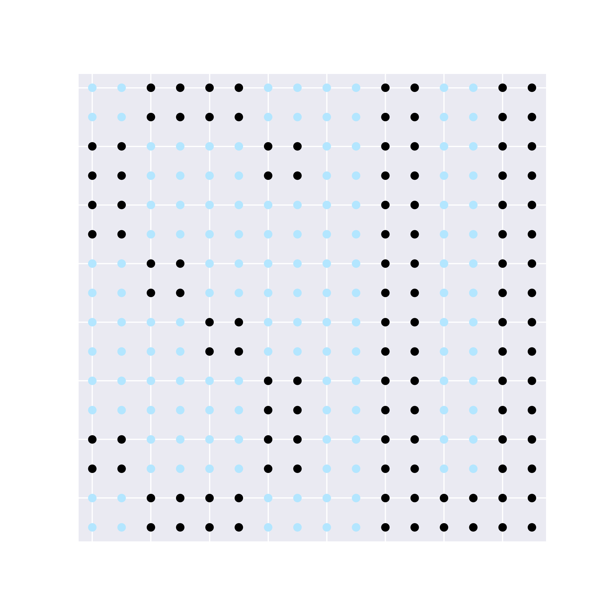
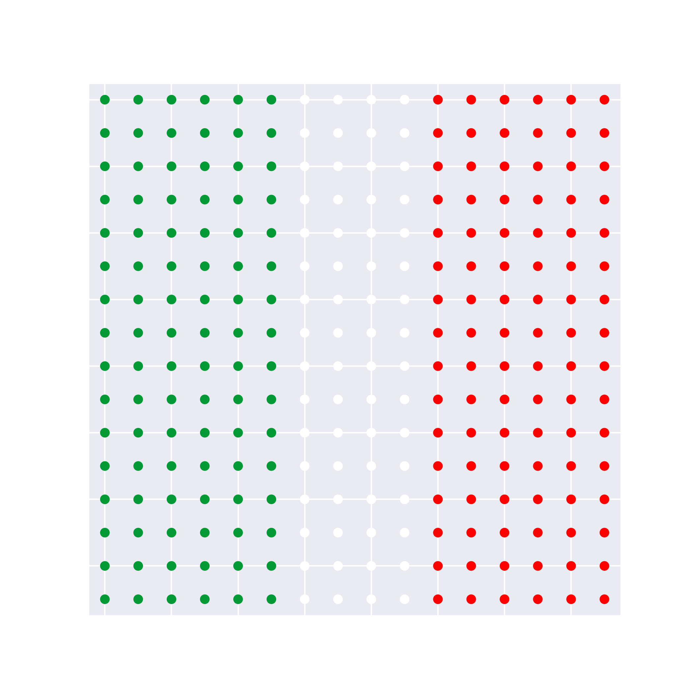
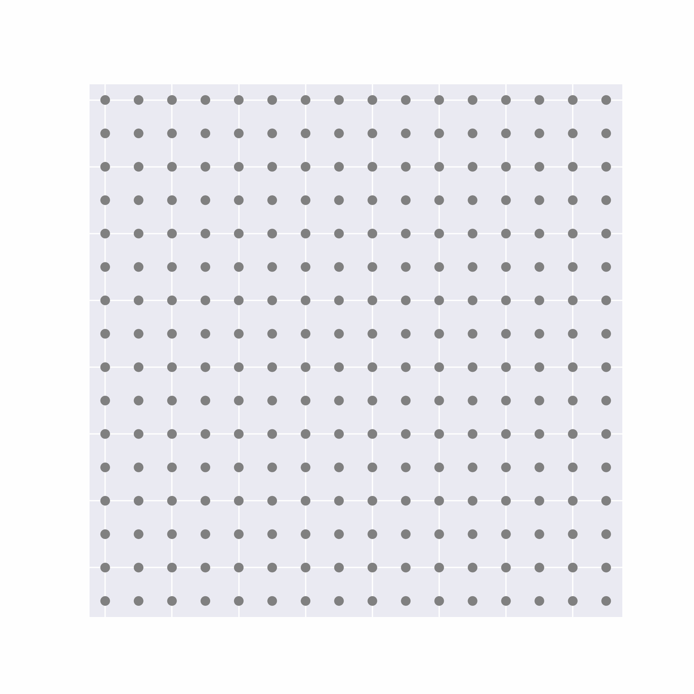
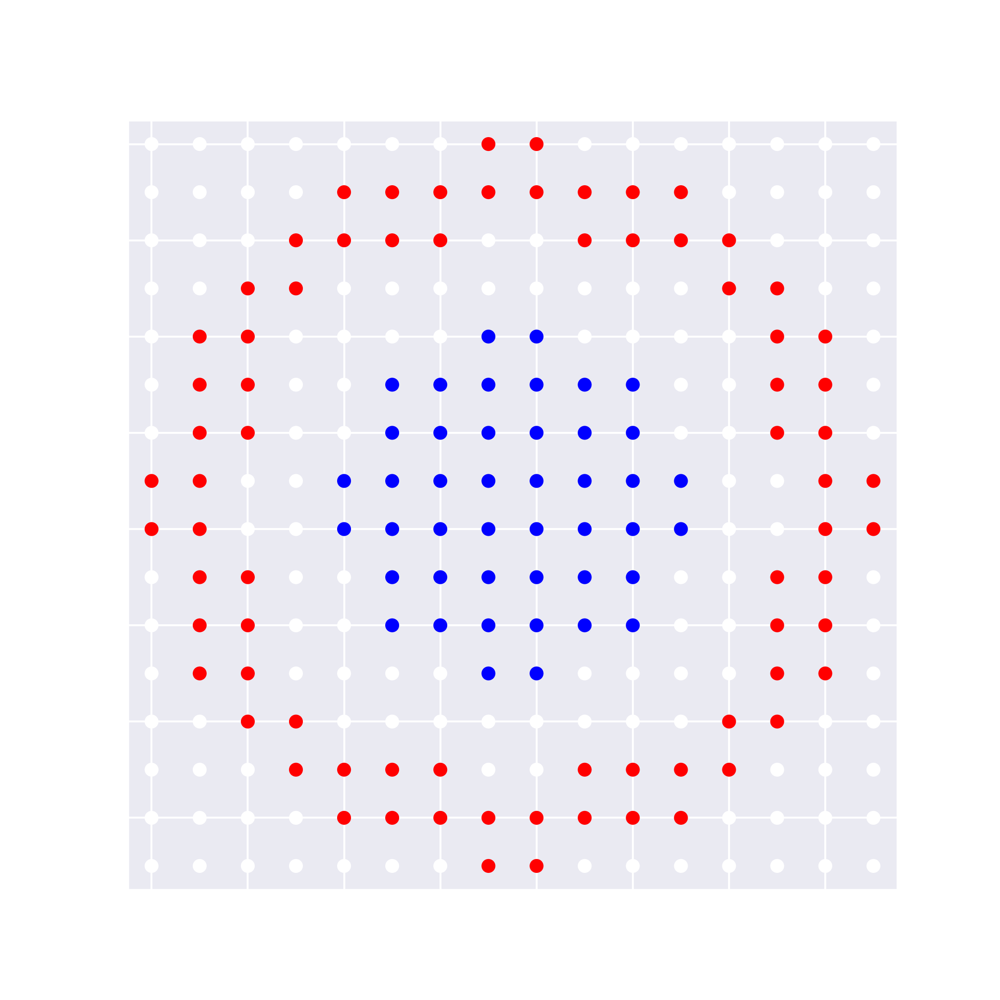
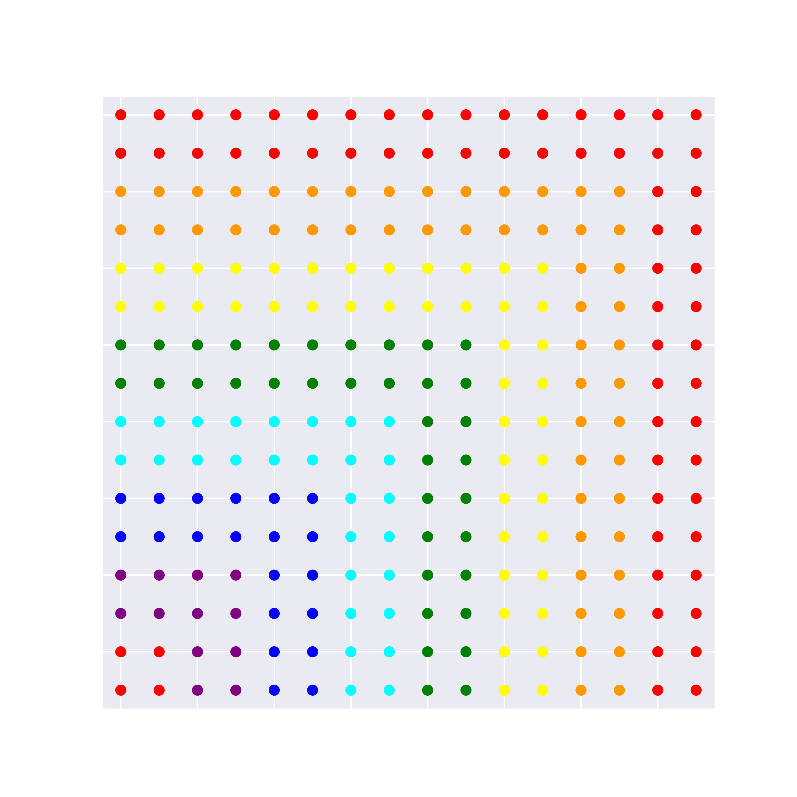

# A Modular Neural Architecture for Distributed Visual Pattern Formation in Robot Swarms

**Alessia Loi, Salman Houdaibi, Nicolas Bredeche**

Abstract. Visual pattern formation in a swarm of robots is a challenging task, as it requires exploiting spatial information so that each robot displays the appropriate color and the swarm collectively matches a target visual pattern. Centralized approaches, as used in drone light shows, rely on robust global positioning (e.g., GPS and ground stations), making them vulnerable to single points of failure. 
In this paper, we present a distributed approach to visual pattern formation in robot swarms, inspired by multicellular artificial ontogeny. We model the swarm as a grid of robots capable of local communication and displaying LED colors to form pixels of a global pattern. We propose a neural controller composed of two modules: a positional information estimator that extracts spatial cues from local interactions, and a pattern module that computes the local visual state (i.e., displayed color) from these cues. 
We introduce two variants of our model, and evaluate them in simulation and on a real robot swarm. Our results show that decomposing visual pattern formation into distributed positional estimation and visual expression substantially improves performance compared to baseline approaches on complex monochromatic and RGB patterns for fixed-size swarms. 
Moreover, a multiscale positional estimator can be reused across swarm sizes, enabling pattern generation at different resolutions without further optimization.
We demonstrate transfer to a physical robot swarm, validating a minimal deployment pipeline in which agents self-assemble into a grid and then execute the distributed controller to produce target visual patterns.

Keywords: Adaptive Pattern Formation, Swarm Robotics, Multi-Cellular Developmental Systems, Evolutionary Optimization.

---

## Pattern Formation Model C[5,5] Examples

### centered-half-discs_16x16

<table>
<tr>
<th>Target</th>
<th>Simulation</th>
</tr>
<tr>
<td align="center">

</td>
<td align="center">

</td>
</tr>
</table>

### bn-smile_16x16

<table>
<tr>
<th>Target</th>
<th>Simulation</th>
</tr>
<tr>
<td align="center">

</td>
<td align="center">

</td>
</tr>
</table>

### bn-SU_16x16

<table>
<tr>
<th>Target</th>
<th>Simulation</th>
</tr>
<tr>
<td align="center">

</td>
<td align="center">

</td>
</tr>
</table>

### rgb-italian-flag_16x16

<table>
<tr>
<th>Target</th>
<th>Simulation</th>
</tr>
<tr>
<td align="center">

</td>
<td align="center">

</td>
</tr>
</table>

### rgb-french-cockade_16x16

<table>
<tr>
<th>Target</th>
<th>Simulation</th>
</tr>
<tr>
<td align="center">

</td>
<td align="center">

</td>
</tr>
</table>

### rgb-rainbow-full_16x16

<table>
<tr>
<th>Target</th>
<th>Simulation</th>
</tr>
<tr>
<td align="center">

</td>
<td align="center">

</td>
</tr>
</table>

